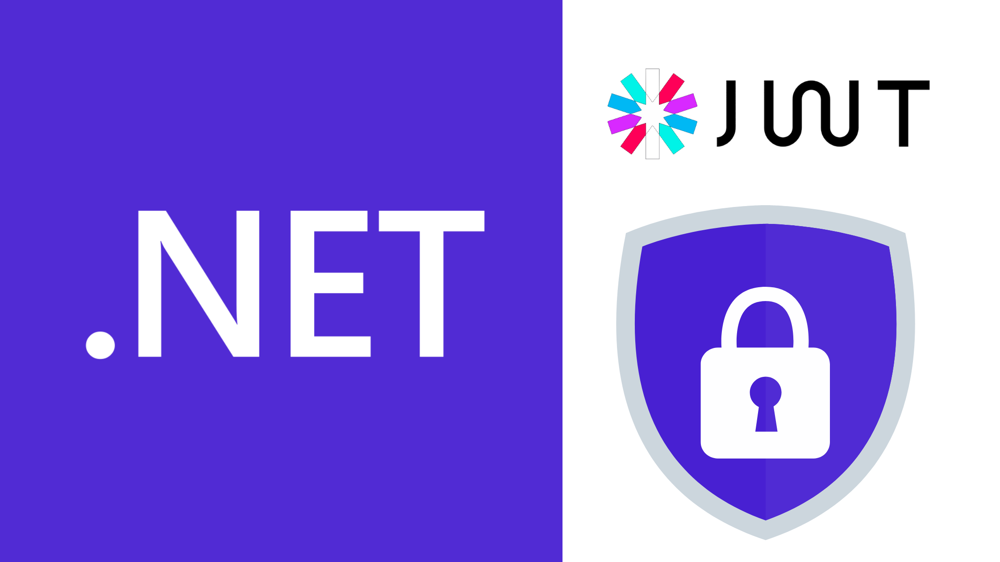
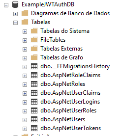
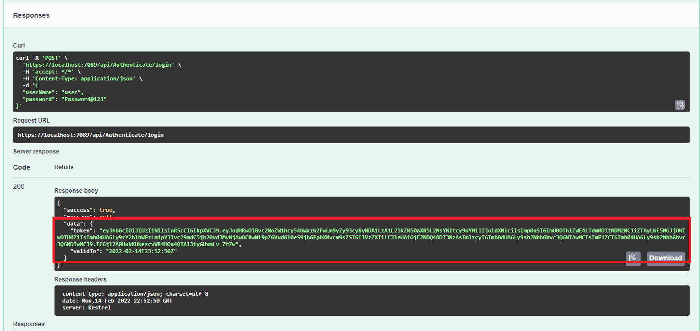
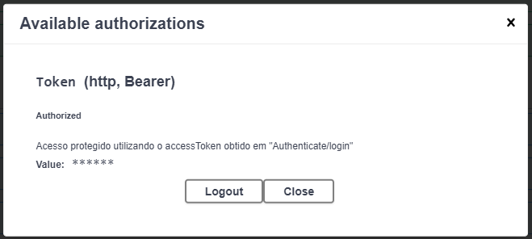

# example-dotnet-identity

## Introdução
Autenticação e Autorização são processos de segurança importantes utilizados para proteger uma aplicação, neste artigo vamos criar uma Web Api implementando a autenticação JWT.

## Pré-requisitos

+ .NET 6
+ Visual Studio Code (VS Code)
+ SQl Server Express 2019 (LocalDB) [Microsoft Docs](https://docs.microsoft.com/pt-br/sql/database-engine/configure-windows/sql-server-express-localdb?view=sql-server-ver15)

## Criando O projeto

Com o comando **`dotnet new webapi`** vamos criar um projeto do tipo Api,  podemos utilizar o parâmetro **`-o`** para criar o projeto dentro de uma pasta.

    dotnet new webapi -o example-dotnet-identity

### Instalando os pacotes necessários

Precisamos instalar os seguintes pacotes no projeto:

+ Microsoft.EntityFrameworkCore.SqlServer 
+ Microsoft.EntityFrameworkCore.Tools
+ Microsoft.AspNetCore.Identity.EntityFrameworkCore 
+ Microsoft.AspNetCore.Authentication.JwtBearer 

Dotnet CLI

    dotnet add package Microsoft.EntityFrameworkCore.SqlServer
    dotnet add package Microsoft.EntityFrameworkCore.Tools
    dotnet add package Microsoft.EntityFrameworkCore.EntityFrameworkCore
    dotnet add package Microsoft.EntityFrameworkCore.JwtBearer

### appsettings.json

Precisamos de algumas configurações como conexão de banco de dados e detalhes para autenticação JWT.

appseting.json

### Data

Vamos criar uma pasta **`Data`** com um arquivo **`ApplicationContext.cs`** onde herdamos de **`IdentityDbContext`** todas as funcionalidades necessárias para controle de tabelas que o ASP.NET Core Identity gera.

ApplicationContext.cs

### Auth

Vamos criar uma pasta **`Auth`** com um arquivo **`UserRoles.cs`** essa classe estática será responsável para representar as possíveis roles do sistema.

userRoles.cs

### Models

Vamos criar uma pasta **`Models`** com os modelos para criar um usuário, fazer login e uma modelo padrão para resposta da api.


CreateUserModel.cs

LoginModel.cs

ResponseModel.cs

### Controllers

Agora vamos criar um controller **`AuthenticateController.cs`** para expor os endpoints para que o usuário possa se autenticar. E o controller **`HomeController.cs`** para validar ...

AuthenticateController.cs
HomeController.cs

### Program

Precisamos adicionar na classe **`Program.cs`** algumas configurações AddDbContext, AddIdentity, AddAuthentication, AddJwtBearer, UseAuthentication e UseAuthorization.

Program.cs


### Migration

Com o comando **`dotnet ef add migration Initial`** vamos criar a estrutura inicial no banco de dados

    dotnet ef migrations add Initial


Logo após podemos utilizar o comando **`dotnet ef database update`** para aplicar a migração.

    dotnet ef database update

Teremos a seguinte estrutura no banco de dados:



*Caso tenha alguma duvida sobre o processo de migrations do ef core confira o seguinte artigo [migrations entity framework core.](https://marcoswoc.net/migrations-entity-framework-core/)*

## Executando o projeto

Agora vamos utilizar o comando **`dotnet run`** para executar o projeto, e acessar a rota **`/swagger`** para visualizar os endpoints disponíveis em nossa API.


Vamos utilizar o endpoint **`/api/Authenticate/register`** para criar dois usuários:

user:
```json
{
  "userName": "user",
  "isAdmin": false,
  "email": "user@example.com",
  "password": "Password@123"
}
```

admin:
```json
{
  "userName": "admin",
  "isAdmin": true,
  "email": "admin@example.com",
  "password": "Password@123"
}
```

Para obter o token vamos utilizar o endpoint **`/api/Authenticate/register`** informando **`username`** e **`password`** como resultado vamos obter o token.



Precisamos informar o token obtido clicando no botão **`Authorize`**.




## Testando Autorização e roles

Nos controllers Home utilizamos a marcação **`[Authorize]`** para proteger um endpoint,  e **`[Authorize(Roles = UserRoles.User)]`** para proteger um endpoint com acesso restrito apenas usuários que possuem a role específica.


**`/api/Home/anonymous`** Qualquer um pode acessar, login não obrigatório.

**`/api/Home/authenticated`** Qualquer usuário do sistema pode acessar, login obrigatório.

**`/api/Home/user`** Apenas usuário do sistema com a role **user** podem acessar, login obrigatório.

**`/api/Home/admin`** Apenas usuário do sistema com a role **admin** podem acessar, login obrigatório.

Ao tentar acessar um endpoint em que o login é obrigatório vamos receber o erro HTTP Unauthorized (401).


Ao tentar acessar um endpoint que o usuário não possui a role específica vamos receber o erro HTTP Forbidden (403).


## Conclusão
O ASP.NET Core Identity permite adicionar a funcionalidade de login em um projeto, permitindo que os usuários de um sistema possam criar uma conta e fazer login simples como o exemplo demonstrado neste artigo ou até mesmo utilizar um provedor externo como Facebook, Google, Microsoft... Para mais informações sobre segurança do ASP.NET Core consulte a [Documentação oficial](https://docs.microsoft.com/pt-br/aspnet/core/security/?view=aspnetcore-6.0).
